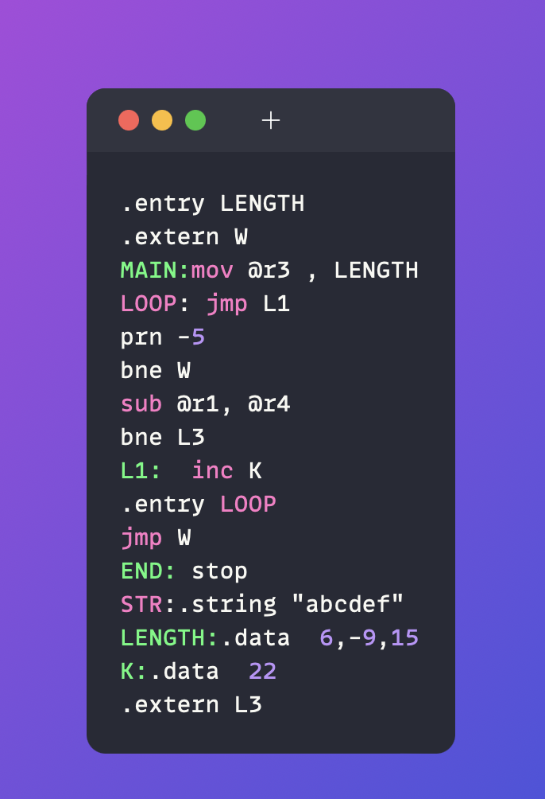
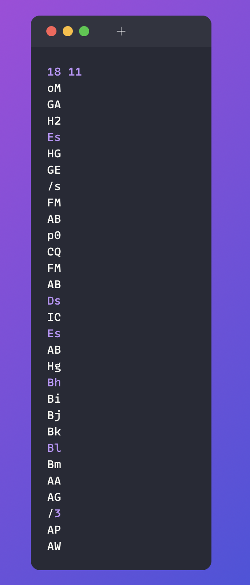
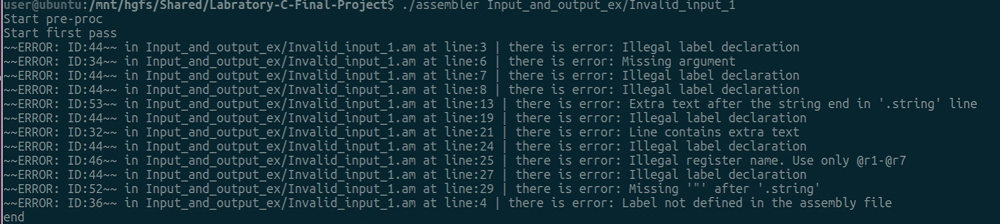

# 🚀 Labratory-C-Final-Project 🚀
## Project Grade - 💯
<p align="center">  </p>

This is the Final project (mmn 14) in Laboratory C 20465- 2023B course at the Open University. This project was developed as part of the "20465 - Systems Programming Laboratory" 2023B course at the Open University. It's a comprehensive assembler program for a specific assembly language, written in C. The purpose is to simulate the operation of common system programs, and thus experience writing a large-scale software project.


☎️ For private lessons and project assistance, please contact me at: **a.shtaigmann@gmail.com**

## 📖 Table of Contents
- [Project Structure](#-project-structure)
- [Getting Started](#-getting-started)
- [Usage](#-usage)
- [Testing](#-testing)
- [Documentation](#-documentation)
- [Contribution](#-contribution)

___

## 🧩 Project Structure

The project consists of multiple C and header files, each serving a specific purpose in the program. It adheres to principles of clarity, readability, structured writing, and data abstraction.

The assembler works in three main stages:

1. **Pre-Processing**
2. **First Pass**
3. **Second Pass**

These stages form the core algorithm of the assembler.

### Pre-Processing

The pre-assembler reads the source file line by line and identifies macro definitions. If a macro is identified, the lines of the macro are added to a macro table and replaced in the source file.

### First Pass

The first pass identifies symbols (labels) and assigns them numerical values representing their corresponding memory addresses.

### Second Pass

In the second pass, the assembler generates the final machine code, replacing operation names with their binary equivalents and symbol names with their assigned memory locations.

Details about the algorithms for these stages can be found in the [documentation](#-documentation).


<details closed><summary>📂 Project Structure</summary>

```bash
repo
├── Errors.c
├── Errors.h
├── Input_and_output_ex
│   ├── Invalid_input_1.am
│   ├── Invalid_input_1.as
│   ├── Invalid_input_2.am
│   ├── Invalid_input_2.as
│   ├── Invalid_input_3.as
│   ├── Invalid_input_4.as
│   ├── c_master.am
│   ├── c_master.as
│   ├── c_master.ent
│   ├── c_master.ext
│   ├── c_master.ob
│   ├── valid_input_1.am
│   ├── valid_input_1.as
│   ├── valid_input_1.ent
│   ├── valid_input_1.ext
│   ├── valid_input_1.ob
│   ├── valid_input_2.am
│   ├── valid_input_2.as
│   ├── valid_input_2.ent
│   ├── valid_input_2.ext
│   ├── valid_input_2.ob
│   ├── valid_input_3.as
│   └── valid_input_4.as
├── LICENSE
├── README.md
├── Readme_imgs
│   ├── Invalid1.png
│   ├── c_master_as.png
│   └── valid_output1.png
├── Tests
│   ├── AsemblerFiles-Test
│   │   ├── CourseExamle.am
│   │   └── CourseExamle.ob
│   ├── TestC.c
│   ├── To-Test
│   │   ├── Almog
│   │   │   ├── AllOpcodeNames.txt
│   │   │   ├── Test4_01.am
│   │   │   ├── Test4_01.as
│   │   │   ├── Test4_01.ob
│   │   │   ├── longline.am
│   │   │   ├── longline.as
│   │   │   ├── test1.am
│   │   │   ├── test1.as
│   │   │   ├── test1.ent
│   │   │   ├── test1.ext
│   │   │   ├── test1.ob
│   │   │   ├── test1_02.am
│   │   │   ├── test1_02.as
│   │   │   ├── test1_02.ob
│   │   │   ├── test3_01.am
│   │   │   ├── test3_01.as
│   │   │   ├── test3_01.ob
│   │   │   ├── test_macro_01.am
│   │   │   ├── test_macro_01.as
│   │   │   ├── test_macro_01.ent
│   │   │   ├── test_macro_01.ext
│   │   │   └── test_macro_01.ob
│   │   ├── Course_master
│   │   │   ├── c_master.am
│   │   │   ├── c_master.ent
│   │   │   ├── c_master.ext
│   │   │   ├── c_master.ob
│   │   │   └── master.ob
│   │   ├── IdeasToTest.md
│   │   ├── Master.am
│   │   ├── Master.as
│   │   └── Master.ob
│   ├── fist_pass_test.c
│   └── test_preproc.c
├── assembler
├── assembler.c
├── code_conversion.c
├── code_conversion.h
├── data_strct.c
├── data_strct.h
├── first_pass.c
├── first_pass.h
├── globals.h
├── handle_text.c
├── handle_text.h
├── lexer.c
├── lexer.h
├── makefile
├── preproc.c
├── preproc.h
├── second_pass.c
├── second_pass.h
├── t_linuix_1.am
├── t_linuix_1.as
├── t_linuix_1.ent
├── t_linuix_1.ext
├── t_linuix_1.ob
├── t_linuix_2.as
├── table.c
├── table.h
├── util.c
└── util.h

8 directories, 94 files
```
</details>
___ 

## ⚙️ Getting Started

### ✔️ Prerequisites

**Please switch to the `linux` branch to run the project. Use the following instructions:**


Before you begin, ensure that you have the following prerequisites installed:
> - `ℹ️ GCC compiler`
> - `ℹ️ Ubuntu system (but others will also work)`

### 📦 Installation

1. Clone the Labratory-C-Final-Project repository:
```sh
git clone https://github.com/AlmogShKt/Labratory-C-Final-Project.git
```

2. Change to the project directory:
```sh
cd Labratory-C-Final-Project
```

3. *Checkout the Linux branch:!*
```sh
git checkout linux
```

5. Run Makefile to compile the program:
```sh
`make`
```


## 🔧 Usage

Run the compiled program using the following command: `./assembler file_name_1 ... file_name_N`

This will output machine code generated from the provided assembly file.

This is valid input and output files:

<p align="center">
   
</p>

And for Invalid output:

<p align="center">
  
</p>


___


___ 

## 🧪 Testing

Several assembly language input files are provided to demonstrate the use of various operations and data types, as well as the assembler's handling of errors.

___ 

## 📚 Documentation

Each function in the source code is accompanied by concise, clear documentation in the form of header comments, explaining its purpose and usage. Important variables are also explained. Detailed comments are present throughout the code for better understanding.

___ 

## 🤝 Contribution

This project does not accept contributions as of now.

___
## 👏🏻 Almog Shtaimgann and Tamir Shemsh ©
